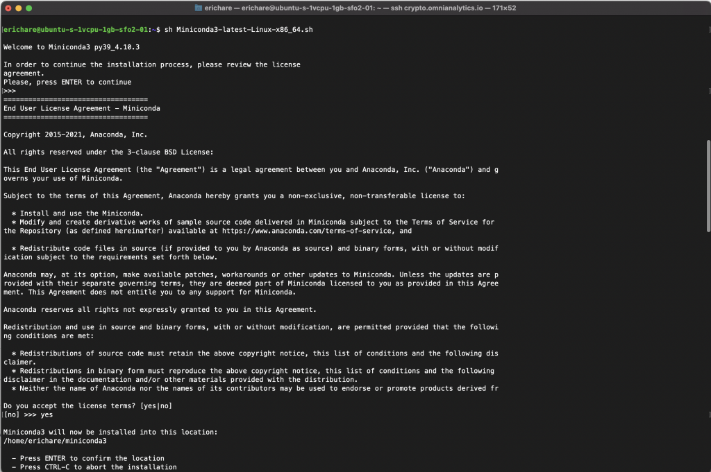
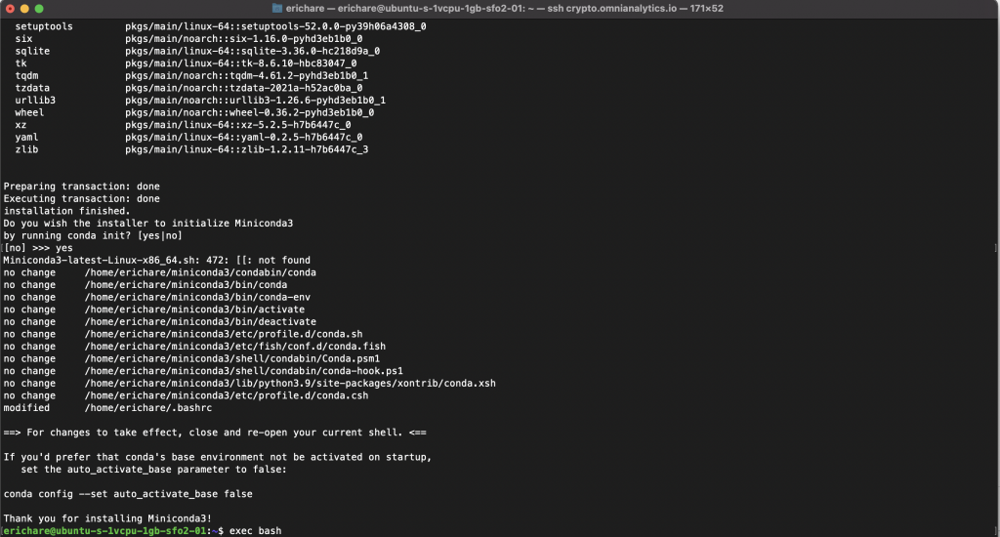
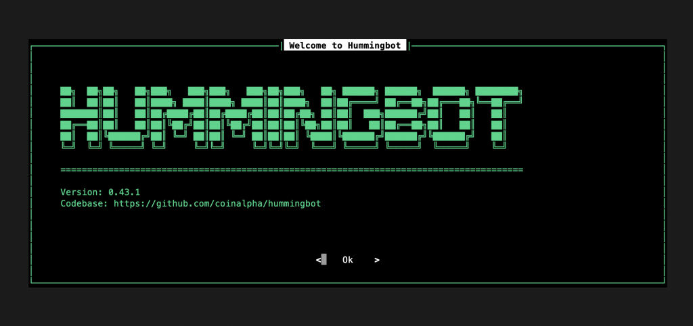

# Hummingbot for Custom Trading Strategies on dydx

The open-source Hummingbot software allows for the definition, implementation, and execution of customized market and trading strategies on a number of platforms. Recently, Hummingbot added support for the dydx platform, allowing for these trading strategies to be performed directly on the dydx platform automatically. In this blog, we will walk through the setup and configuration of Hummingbot, and show how to use it to define and execute a market strategy on dydx.

## Hummingbot Installation

There are several supported installation methods for Hummingbot, including installation via Docker. For a full breakdown of the options, please see the official documentation:

- [https://docs.hummingbot.io/installation/linux/](https://docs.hummingbot.io/installation/linux/)  

In this blog, we will assume a manual installation on **Ubuntu 20.04**.

### Installing Miniconda

1. sudo apt update
2. sudo apt install -y build-essential
3. wget https://repo.continuum.io/miniconda/Miniconda3-latest-Linux-x86\_64.sh
4. sh Miniconda3-latest-Linux-x86\_64.sh

At this stage, you will be presented with several options dictating the installation of Miniconda. In most cases, the defaults should suffice. Running the bash script to complete the Miniconda installation may take several minutes. Once the installation is complete, we need to reload Bash in order to detect Miniconda. Simply run:

- `exec bash`

Now, we are ready to proceed by installing Hummingbot.

### Installing Hummingbot

1. git clone https://github.com/CoinAlpha/hummingbot.git
2. cd hummingbot && ./clean && ./install
3. conda activate hummingbot && ./compile

These steps, particularly cloning the repository and compiling the source code, can take a few minutes to complete. This will ensure that the conda environment is activated, and hummingbot is ready to be executed.

### Running Hummingbot

To run Hummingbot, we simply need to execute the following command:

bin/hummingbot.py

You should be presented with this screen if everything worked as expected:

Now we are ready to begin implementing our trading strategy!

## \## Interacting with dydx

We are now ready to begin interacting and trading on the dydx platform using Hummingbot! To begin, we need to obtain credentials from the dydx site. The API key and Stark keys are the values needed from the platform. Hummingbot will require this in order to begin making trades. We just need to choose dydx\_perpetual as our protocol, and then we can begin interacting with the platform.

At this point, we have everything needed to begin making trades. We supply a number of strategy parameters as requested by Hummingbot. The strategy is saved as a structured YAML file, which can be read in plain text and parsed as needed to read in elements of that strategy. When we execute the strategy, immediately the trades are performed if the criteria is met. An example of this is shown in the video below:

## Video Tutorial

A full tutorial of the setup process, and the strategy making procedure, is given below:
